# th-worker-bugherd

Cloudflare Worker para sincronización bidireccional entre BugHerd y GitHub con notificaciones a Discord.

## Arquitectura

```mermaid
flowchart TB
    subgraph BugHerd
        BH[("🐛 BugHerd<br/>Task Board")]
    end

    subgraph Cloudflare
        CW["⚡ th-worker-bugherd<br/>Cloudflare Worker"]
    end

    subgraph GitHub
        GH[("🐙 GitHub<br/>Issues")]
    end

    subgraph Discord
        DC[("💬 Discord<br/>Channel")]
    end

    BH -->|"task_create<br/>task_update"| CW
    CW -->|"Create/Update Issue<br/>+ Assign Developer"| GH
    CW -->|"🔔 Nuevo Bug<br/>@developer"| DC

    GH -->|"issue closed<br/>issue reopened"| CW
    CW -->|"Update Status<br/>(in review/doing)"| BH
    CW -->|"🎉 Bug Cerrado<br/>@developer"| DC

    style CW fill:#f96,stroke:#333,stroke-width:2px
    style BH fill:#6cf,stroke:#333,stroke-width:2px
    style GH fill:#6f6,stroke:#333,stroke-width:2px
    style DC fill:#99f,stroke:#333,stroke-width:2px
```



## Flujos

### 1. Nuevo Bug (BugHerd → GitHub → Discord)

```mermaid
sequenceDiagram
    participant BH as BugHerd
    participant CW as Worker
    participant GH as GitHub
    participant DC as Discord

    BH->>CW: POST /webhook/bugherd (task_create)
    CW->>GH: Create Issue + Labels
    GH-->>CW: Issue #123
    CW->>GH: Assign Developer
    CW->>BH: Set external_id = 123
    CW->>DC: 🐛 Nuevo Bug @developer
```



### 2. Bug Cerrado (GitHub → BugHerd → Discord)


## Features

- **BugHerd → GitHub**: Crea issues automáticamente desde tasks de BugHerd
- **GitHub → BugHerd**: Sincroniza estado cuando se cierra/reabre un issue
- **Discord Notifications**: Notificaciones con mención al desarrollador
- **Auto-assignment**: Mapea tags de BugHerd a usernames de GitHub y Discord

## Setup

### 1. Instalar dependencias

```bash
npm install
```

### 2. Configurar secrets en Cloudflare

```bash
wrangler secret put GITHUB_TOKEN
wrangler secret put BUGHERD_API_KEY
wrangler secret put GITHUB_WEBHOOK_SECRET
wrangler secret put DISCORD_WEBHOOK_TH_APP
```

### 3. Deploy

```bash
npm run deploy
```

### 4. Configurar webhooks

```bash
export BUGHERD_API_KEY=your_api_key
export GITHUB_TOKEN=your_token
export GITHUB_WEBHOOK_SECRET=your_secret
export WORKER_URL=https://th-worker-bugherd.twiinshrm.workers.dev

npm run setup:bugherd
npm run setup:github
```

## Endpoints

| Endpoint | Descripción |
|----------|-------------|
| `POST /webhook/bugherd` | Recibe eventos task_create y task_update de BugHerd |
| `POST /webhook/github` | Recibe eventos de issues de GitHub |
| `POST /health` | Health check |

## Agregar Desarrolladores

Edita `src/config/developers.ts`:

```typescript
const DEV_MAPPING: Record<string, DeveloperInfo> = {
  // Tag en BugHerd          GitHub Username visita https://github.com/USERNAME
  //     ↓                        ↓                Discord ID (click derecho → Copiar ID)
  //     ↓                        ↓                     ↓
  "DEV Manuel Castillo": { github: "ManuelCastillo829", discordId: "1057656769041666088" },
  "DEV Ricky Cortes":    { github: "RickyBv24",         discordId: "748912747554799638" },
  "DEV Chris Segovia":   { github: "csegoviaz",         discordId: "601246979028156426" },
  "DEV Chris Zapata":    { github: "CristhianTwiins",   discordId: "1209536555077599265" },
  "DEV Camilo Escudero": { github: "camiloescudero-ops",discordId: "1424842769607688192" },
  "DEV Isaac Armijos":   { github: "supIsaax",          discordId: "752559714403090514" },
  "DEV Rory Zambrano":   { github: "rorysambrano8000",  discordId: "751903164914991206" },
  
  // Para agregar un nuevo desarrollador:
  // 1. Crea el tag en BugHerd (ej: "DEV Nuevo Dev")
  // 2. Obtén su username de GitHub
  // 3. Obtén su Discord ID:
  //    - Activa Modo Desarrollador en Discord (Ajustes → Avanzado)
  //    - Click derecho en el usuario → "Copiar ID de usuario"
  // 4. Agrega la línea aquí y re-deploya
};
```

### Obtener Discord ID

1. Abre Discord
2. Ve a **Ajustes de Usuario** → **Avanzado** → Activa **Modo Desarrollador**
3. Click derecho en el usuario → **Copiar ID de usuario**
4. El ID es un número largo como: `601246979028156426`

## Agregar Proyectos

Edita `src/config/projects.ts`:

```typescript
const PROJECT_MAPPING: ProjectMapping[] = [
  {
    bugherdProjectId: 464238,              // ID del proyecto en BugHerd
    githubOwner: "TwiinsHrm",              // Organización de GitHub
    githubRepo: "th-app",                  // Repositorio
    discordWebhookEnvKey: "DISCORD_WEBHOOK_TH_APP",  // Nombre del secret
    closedStatusColumn: "in review",       // Columna en BugHerd al cerrar
  },
  // Para agregar otro proyecto:
  // 1. Obtén el project ID de BugHerd (Settings → API)
  // 2. Crea un webhook de Discord para ese proyecto
  // 3. Agrega el secret: wrangler secret put DISCORD_WEBHOOK_NUEVO_PROYECTO
  // 4. Agrega la configuración aquí y re-deploya
];
```

### Obtener BugHerd Project ID

```bash
curl -u "TU_API_KEY:x" https://www.bugherd.com/api_v2/projects.json
```

## Development

```bash
npm run dev        # Desarrollo local
npm run typecheck  # Verificar tipos
npm run deploy     # Desplegar a producción
```

## Logs

Ver logs en tiempo real:

```bash
npx wrangler tail
```

## License

Private - TwiinsHrm
